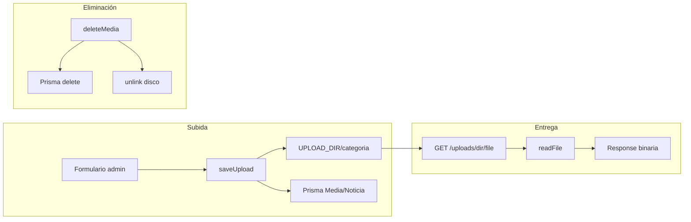

# Gestión de medios — Las Violetas Web

Documentación del flujo de subida, entrega, eliminación y sincronización con noticias.

---

## 1. Modelo de datos (`Media`)

```prisma
model Media {
  id          String      @id @default(cuid())
  url         String      // ej. /uploads/galeria/uuid.webp
  tipo        MediaTipo   // image | video
  origen      MediaOrigen // directo | noticia
  asociadoAId String?     // noticia vinculada (si origen = noticia)
  tamanoBytes Int
  destacado   Boolean
  fecha       DateTime
}
```

No se almacena el nombre original del archivo en disco: el fichero físico usa `UUID + extensión`. La URL pública es la referencia estable.

---

## 2. Flujo de subida

### 2.1 Galería directa (`/admin/galeria`)

1. El formulario cliente (`GaleriaForm`) envía `POST /api/media` con `multipart/form-data`.
2. `saveUpload(file, "galeria")` en `src/lib/uploads.ts`:
   - Valida MIME y extensión.
   - Comprueba cuota (`assertStorageQuota`).
   - Escribe en `{UPLOAD_DIR}/galeria/{uuid}.ext`.
   - Devuelve URL `/uploads/galeria/...`.
3. `prisma.media.create` con `origen: "directo"`.
4. `revalidatePath("/admin/galeria")` y `/galeria`.

### 2.2 Noticias (`/admin/noticias`)

1. `POST /api/noticias` recibe portada e imágenes adicionales.
2. Cada archivo se guarda con `saveUpload(file, "noticias")` → `{UPLOAD_DIR}/noticias/`.
3. Dentro de **`prisma.$transaction`**:
   - Se crea el registro `Noticia` (`portadaUrl`, `imagenes[]`).
   - `syncMediaFromNoticia(noticiaId, mediaItems, tx)` registra cada URL en `Media` con `origen: "noticia"` y `asociadoAId`.
4. Revalidación de rutas admin y públicas.

### 2.3 Documentos

`saveUpload(file, "documentos")` → tabla `Documento` (no `Media`). Misma raíz `UPLOAD_DIR`.

---

## 3. Entrega dinámica (streaming)

**Ruta:** `src/app/uploads/[dir]/[file]/route.ts`

| Paso | Acción |
|------|--------|
| Validar | `dir` ∈ `galeria`, `noticias`, `documentos` |
| Sanitizar | `safeUploadFilename(file)` — bloquea `..` y rutas absolutas |
| Leer | `fs.promises.readFile(join(UPLOAD_DIR, dir, file))` |
| Responder | `Content-Type` por extensión, `Cache-Control: public, max-age=31536000, immutable` |
| Error | JSON `{ error: "Archivo no encontrado" }` con status 404 |

Esto evita 404 en despliegues standalone donde `public/uploads` no se empaqueta en la imagen Docker.

---

## 4. Eliminación y recolector de basura

### Server Action (`deleteMedia`)

Archivo: `src/app/admin/galeria/actions.ts`

1. Verificar sesión admin.
2. `prisma.media.delete({ where: { id } })`.
3. `deleteStoredFileByUrl(media.url)` → `fs.promises.unlink` en disco (`src/lib/upload-delete.ts`).
4. `revalidatePath("/admin/galeria")`.

### API REST

`DELETE /api/media/[id]` ejecuta el mismo flujo (útil para integraciones).

Si el archivo ya no existe en disco (`ENOENT`), se ignora; el registro DB se elimina igualmente.

---

## 5. Sincronización atómica Noticias ↔ Galería

**Módulo:** `src/lib/media-sync.ts`

Función principal: `syncMediaFromNoticia(noticiaId, items, tx)`

Dentro de la **misma transacción** que crea la noticia:

1. `deleteMany` de registros `Media` previos con `asociadoAId = noticiaId` y `origen = "noticia"`.
2. `createMany` con un registro por URL única (portada + galería incrustada).

Helper: `buildMediaRecord()` genera el payload Prisma consistente (`url`, `tipo`, `tamanoBytes`, `origen`, `asociadoAId`).

**Garantía:** Si falla la transacción, no quedan registros huérfanos de esa noticia en `Media`. Los archivos en disco de una subida fallida pueden quedar sin referencia (limpieza manual opcional).

---

## 6. Cuota de almacenamiento

`src/lib/storage.ts`:

- `getUsedStorageBytes()` = suma `Media.tamanoBytes` + `Documento.tamanoBytes`.
- `assertStorageQuota(additionalBytes)` lanza `StorageQuotaError` antes de escribir.

El widget de admin refleja el porcentaje usado respecto a `MAX_STORAGE_GB`.

---

## 7. UI de administración

| Componente | Función |
|------------|---------|
| `GaleriaForm` | Subida con `formRef`, reset seguro tras éxito, `router.refresh()` |
| `GaleriaMediaGrid` | Miniaturas `aspect-square object-cover`, botones Eye / Trash |
| `MediaPreviewLightbox` | Modal Framer Motion, imagen/video a tamaño completo |

### Aspect ratio

- **Admin (grid):** miniaturas forzadas a cuadrado con `object-cover`.
- **Público (`GaleriaGrid`, detalle noticia):** `max-w-full h-auto` para respetar proporciones verticales/panorámicas.

---

## 8. Tipos de archivo permitidos

| Categoría | Extensiones | MIME |
|-----------|-------------|------|
| galeria / noticias | jpg, jpeg, png, webp, mp4 | image/*, video/mp4 |
| documentos | pdf, docx | application/pdf, docx |

---

## 9. Diagrama de flujo



---

## 10. Archivos clave

| Ruta | Rol |
|------|-----|
| `src/lib/uploads.ts` | Validación y escritura |
| `src/lib/upload-paths.ts` | `UPLOAD_DIR`, rutas seguras |
| `src/lib/upload-delete.ts` | Borrado físico por URL |
| `src/lib/media-sync.ts` | Sincronización noticias |
| `src/app/uploads/[dir]/[file]/route.ts` | Streaming HTTP |
| `src/app/api/media/route.ts` | API galería |
| `src/app/api/noticias/route.ts` | API noticias + sync |
